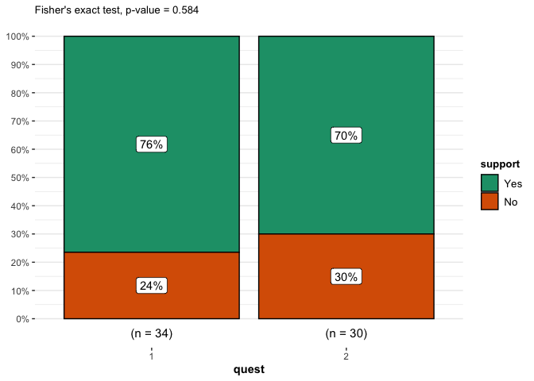
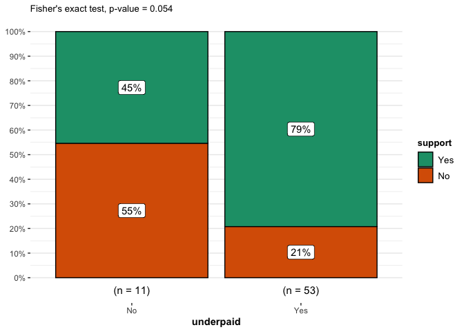
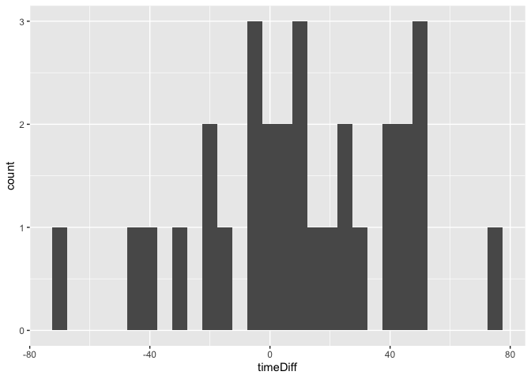

-   [1 Advisory referendum](#advisory-referendum)
    -   [1.1 Introduction](#introduction)
    -   [1.2 Overview of Literature](#overview-of-literature)
    -   [1.3 Experiment Structure](#experiment-structure)
        -   [1.3.1 Surveys](#surveys)
        -   [1.3.2 Subjects](#subjects)
    -   [1.4 Analysis](#analysis)
        -   [1.4.1 Advisory Referendum](#advisory-referendum-1)
        -   [1.4.2 Opinion and Support](#opinion-and-support)
        -   [1.4.3 Time Difference](#time-difference)
        -   [1.4.4 Possible Concerns](#possible-concerns)
    -   [1.5 Conclusion](#conclusion)

# 1 Advisory referendum

## 1.1 Introduction

In this paper we will look at whether structuring survey as advisory
referendum or binding referendum with monetary consequences changes the
responses. An experiment consisted of 2 surveys one stating that
“answers will not have impact on future policy” and “answers will have
impact future policy”. The surveys were administered to 64 students at
the University of San Francisco. The analysis concluded that there is
not statistically significant difference between the two surveys.
Additionally, the opinion expressed is statistically predictive of the
willingness to contribute. Lastly, time spent on binding referendum is
statistically significantly larger.

## 1.2 Overview of Literature

In “Field Experiments”, Glenn W. Harrison and John A. List post an
important question whether “It remains an open question if these
“advisory referenda” actually motivate subjects to respond truthfully.”
Unfortunately, not much work has been done to answer this question
empirically. In “The Advisory Referendum in America”, Ralph M. Goldman
concludes that introduction of Advisory Referendum would tend to
increase public participation in important issues and to improve
communication between legislators and the electorate. And in
“Understanding the Uses and Limitations of the Advisory Referendum”,
John B. Murphey, Rosenthal, Coblentz & Janega found that respondents did
not have a clear preference for binding referendums over advisory ones.
We aimed to contribute to the small body of research looking to answer
the question whether advisory referendum produces the same results as
binding referendum, but at a lower cost.

## 1.3 Experiment Structure

Students will receive a questionnaire, asking whether they believe
service workers are underpaid and whether they would approve an increase
of wages for university service workers funded by increased tuition.
There is will be no expected benefit to subjects and their decision
would be anonymous. This limitations are to limit possible effects of
warm glow or perception of future benefits.

The control group would be asked for general nonbinding thoughts and
opinions regarding the issue. The treatment group would be asked to make
a decision that would most definitely have an impact on future policy.
The difference between the two tests would then reflect the change of
commitment associated with opinion and actual decision-making.

### 1.3.1 Surveys

The experiment was distributed through 2 GoogleForm surveys.
Questionnaire 1 asked for an opinion on current pay situation of service
workers at the University of San Francisco and whether they were willing
to support an initiative to increase minimal wage by contributing $200
through increased tuition. It was stressed that the results will have no
impact on future university policy. Questionnaire 2 was similar to the
first, except it pointed that the results might have impact on the
future policy and thus increase tuition.

Questionnaires

### 1.3.2 Subjects

The subjects of the experiment were 64 students from undergraduate
Economics classes at the University of San Francisco. The surveys were
distributed at the end of classes, the class was split into two equal
groups and subjects completed their surveys by scanning QR codes from
the white board. A sample of the data is presented below.

<table>
<thead>
<tr class="header">
<th style="text-align: right;">endTime</th>
<th style="text-align: right;">startTime</th>
<th style="text-align: left;">underpaid</th>
<th style="text-align: left;">support</th>
<th style="text-align: right;">quest</th>
<th style="text-align: left;">date</th>
<th style="text-align: right;">timeTaken</th>
</tr>
</thead>
<tbody>
<tr class="odd">
<td style="text-align: right;">15H 31M 18S</td>
<td style="text-align: right;">15H 30M 0S</td>
<td style="text-align: left;">Yes</td>
<td style="text-align: left;">Yes</td>
<td style="text-align: right;">1</td>
<td style="text-align: left;">2022-03-08</td>
<td style="text-align: right;">78</td>
</tr>
<tr class="even">
<td style="text-align: right;">15H 33M 31S</td>
<td style="text-align: right;">15H 30M 0S</td>
<td style="text-align: left;">Yes</td>
<td style="text-align: left;">Yes</td>
<td style="text-align: right;">1</td>
<td style="text-align: left;">2022-03-08</td>
<td style="text-align: right;">211</td>
</tr>
<tr class="odd">
<td style="text-align: right;">13H 57M 34S</td>
<td style="text-align: right;">13H 57M 1S</td>
<td style="text-align: left;">Yes</td>
<td style="text-align: left;">Yes</td>
<td style="text-align: right;">1</td>
<td style="text-align: left;">2022-04-01</td>
<td style="text-align: right;">33</td>
</tr>
<tr class="even">
<td style="text-align: right;">13H 58M 40S</td>
<td style="text-align: right;">13H 57M 1S</td>
<td style="text-align: left;">Yes</td>
<td style="text-align: left;">No</td>
<td style="text-align: right;">2</td>
<td style="text-align: left;">2022-04-01</td>
<td style="text-align: right;">99</td>
</tr>
<tr class="odd">
<td style="text-align: right;">15H 14M 55S</td>
<td style="text-align: right;">15H 14M 0S</td>
<td style="text-align: left;">Yes</td>
<td style="text-align: left;">Yes</td>
<td style="text-align: right;">1</td>
<td style="text-align: left;">2022-04-04</td>
<td style="text-align: right;">55</td>
</tr>
<tr class="even">
<td style="text-align: right;">15H 14M 47S</td>
<td style="text-align: right;">15H 13M 0S</td>
<td style="text-align: left;">No</td>
<td style="text-align: left;">No</td>
<td style="text-align: right;">2</td>
<td style="text-align: left;">2022-04-04</td>
<td style="text-align: right;">107</td>
</tr>
<tr class="odd">
<td style="text-align: right;">15H 15M 45S</td>
<td style="text-align: right;">15H 14M 0S</td>
<td style="text-align: left;">No</td>
<td style="text-align: left;">Yes</td>
<td style="text-align: right;">2</td>
<td style="text-align: left;">2022-04-04</td>
<td style="text-align: right;">105</td>
</tr>
</tbody>
</table>

## 1.4 Analysis

### 1.4.1 Advisory Referendum

Fischer Exact Test was used to test whether the willingness to support
the initiative was affected by advisory referenda. The resulting p-value
was 0.584, which is significantly above 10%, thus we cannot reject the
H0 that there is no difference between two surveys.

Fischer Exact Test on effect of advisory referendum

### 1.4.2 Opinion and Support

Fischer Exact Test was used to test whether the opinion on service
workers’ minimal wage issue affected the decision to contribute. The
resulting p-value was 0.054, which allows us to reject H0 that opinion
did not affect the decision to support the initiative.

Fischer Exact Test on translation of opinion to support

### 1.4.3 Time Difference

To record time the respondants were asked to input current time into the
survey (because of limitations of Google Forms). Total time spent on the
survey was calculated by subtracting time inputted from time of
submission. Because the participants had to enter the time with minute
accuracy, there is error inbeded into the measurement. Since everyone in
the same group started at the same time, mean time for control is t and
mean time for treatment is t + *Δ*t (extra time). We can find *Δ*t by
subtracting time mean of control from treatment. To test whether *Δ*t is
bigger than 0 a one-tail t.test. I other words, we tested whether
students administered referendum survey took longer to respond. The
resulting p-value was 0.063, which allows us to reject H0 that
referendum survey had no impact on the response time at 10% level.

t.test on whether advisory referendum had impact on time to response

    ## 
    ##  One Sample t-test
    ## 
    ## data:  timeData$timeDiff
    ## t = 1.5769, df = 29, p-value = 0.06283
    ## alternative hypothesis: true mean is greater than 0
    ## 95 percent confidence interval:
    ##  -0.7293294        Inf
    ## sample estimates:
    ## mean of x 
    ##  9.412656

### 1.4.4 Possible Concerns

We have to address weak points of our experiment. Verbal post survey
evaluation indicated that subjects could not notice the difference
between the two questionnaires. It is possible that they did not account
for the binding and non-binding nature of questions and perceived them
as equal. In the real world the nature of the vote would be strengthened
through communication channels prior to the distribution making the
repercussions clear. Another concern is that the subjects did not read
the instructions and randomly filled in the answers as 4 of 11 people,
who believed the workers were paid fairly elected to support the
increase in tuition. Lastly, the sample size is not sufficiently large
to confirm small differences in behavior.

## 1.5 Conclusion

To sum up, there is no statistically significant difference between
advisory and binding referendum. Combined with the studies discussed at
the very beginning our finding proposes a wider introduction of opinion
surveys to measure societal opinion and commitment. Without apparent
difference in results, advisory referendum offers higher participation
rate and involvement (Ralph M. Goldman) at a lower cost and shorter time
to develop and deploy.
