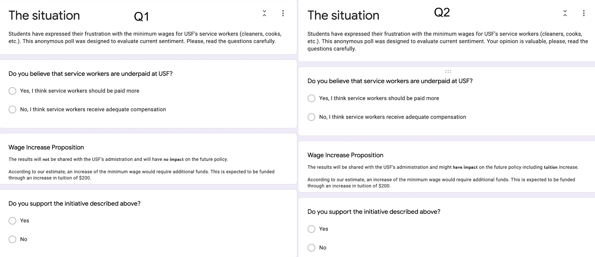

-   [1 Advisory referendum](#advisory-referendum)
    -   [1.1 Introduction](#introduction)
    -   [1.2 Overview of Literature](#overview-of-literature)
    -   [1.3 Experiment Structure](#experiment-structure)
        -   [1.3.1 Surveys](#surveys)
        -   [1.3.2 Subjects](#subjects)
    -   [1.4 Analysis](#analysis)
        -   [1.4.1 Advisory Referendum](#advisory-referendum-1)
        -   [1.4.2 Opinion and Support](#opinion-and-support)
        -   [1.4.3 Time Difference](#time-difference)
        -   [1.4.4 Possible Concerns](#possible-concerns)
    -   [1.5 Conclusion](#conclusion)

# 1 Advisory referendum

## 1.1 Introduction

In this paper, we attempt to answer the question if an advisory
referendum or binding referendum with monetary consequences would
influence people’s responses through structuring a survey. An experiment
was conducted which consisted of 2 surveys (i) one stating that “answers
will not have impact on future policy” and (ii) “answers will have
impact future policy”. The surveys were administered to 64 students at
the University of San Francisco. The analysis concluded that there was
no statistical significant difference between the two surveys.
Additionally, the opinion expressed was statistically predictive of the
willingness of contribution. It is worth noting that the time spent on
binding referendums was statistically significantly larger.

## 1.2 Overview of Literature

In “Field Experiments”, Glenn W. Harrison and John A. List posed an
important question, asking if “It remains an open question that these
“advisory referenda” actually motivate subjects to respond truthfully.”
Unfortunately, not much academic work has been done to truly answer this
question empirically. In “The Advisory Referendum in America”, Ralph M.
Goldman concludes that the introduction of the Advisory Referendum would
tend to increase public participation in important issues and also
improve communication between legislators and the electorate. In the
paper “Understanding the Uses and Limitations of the Advisory
Referendum”, John B. Murphey, Rosenthal, Coblentz & Janega found that
respondents did not have a clear preference for binding referendums over
advisory ones. Through the experiment, we contributed to this small body
of research, attempting to answer the question whether advisory
referendums produce the same results as binding referendums.

## 1.3 Experiment Structure

Students received a questionnaire, asking whether they believe service
workers are underpaid and whether they would approve an increase in
wages for university service workers funded by an increase in tuition.
There would be no expected explicit benefit to the subjects and their
decision would be anonymous. These constraints were to limit the
possible effects of ‘warm glow’ and the perception of future benefits.

The control group would be asked for their own general non-binding
thoughts and opinions regarding this issue. The treatment group would be
asked to make a decision that would ultimately have an impact on future
policy. The difference between the two tests would then reflect the
change of commitment associated with opinion and actual decision-making.

### 1.3.1 Surveys

The experiment was distributed through two separate GoogleForm surveys.
In questionnaire 1, we asked for the subject’s opinion on the current
pay situation of service workers at the University of San Francisco and
whether they were willing to support an initiative to increase minimum
wage by contributing $200 through an increase in tuition. It was
stressed and bolded that the results will have no impact on the future
of USF’s university policy. Questionnaire 2 was similar to the first,
except that it stressed that the results might have an impact on the
future policy and possibly increasing the tuition.

Questionnaires

### 1.3.2 Subjects

The subjects of the experiment were 64 students from the undergraduate
Economics programme at the University of San Francisco. The surveys were
distributed at the end of classes; the class was split into two equal
groups and the subjects completed their surveys by scanning the QR codes
from the board. A sample of the data is presented below.

<table>
<thead>
<tr class="header">
<th style="text-align: right;">endTime</th>
<th style="text-align: right;">startTime</th>
<th style="text-align: left;">underpaid</th>
<th style="text-align: left;">support</th>
<th style="text-align: right;">quest</th>
<th style="text-align: left;">date</th>
<th style="text-align: right;">timeTaken</th>
</tr>
</thead>
<tbody>
<tr class="odd">
<td style="text-align: right;">15H 31M 18S</td>
<td style="text-align: right;">15H 30M 0S</td>
<td style="text-align: left;">Yes</td>
<td style="text-align: left;">Yes</td>
<td style="text-align: right;">1</td>
<td style="text-align: left;">2022-03-08</td>
<td style="text-align: right;">78</td>
</tr>
<tr class="even">
<td style="text-align: right;">15H 33M 31S</td>
<td style="text-align: right;">15H 30M 0S</td>
<td style="text-align: left;">Yes</td>
<td style="text-align: left;">Yes</td>
<td style="text-align: right;">1</td>
<td style="text-align: left;">2022-03-08</td>
<td style="text-align: right;">211</td>
</tr>
<tr class="odd">
<td style="text-align: right;">13H 57M 34S</td>
<td style="text-align: right;">13H 57M 1S</td>
<td style="text-align: left;">Yes</td>
<td style="text-align: left;">Yes</td>
<td style="text-align: right;">1</td>
<td style="text-align: left;">2022-04-01</td>
<td style="text-align: right;">33</td>
</tr>
<tr class="even">
<td style="text-align: right;">13H 58M 40S</td>
<td style="text-align: right;">13H 57M 1S</td>
<td style="text-align: left;">Yes</td>
<td style="text-align: left;">No</td>
<td style="text-align: right;">2</td>
<td style="text-align: left;">2022-04-01</td>
<td style="text-align: right;">99</td>
</tr>
<tr class="odd">
<td style="text-align: right;">15H 14M 55S</td>
<td style="text-align: right;">15H 14M 0S</td>
<td style="text-align: left;">Yes</td>
<td style="text-align: left;">Yes</td>
<td style="text-align: right;">1</td>
<td style="text-align: left;">2022-04-04</td>
<td style="text-align: right;">55</td>
</tr>
<tr class="even">
<td style="text-align: right;">15H 14M 47S</td>
<td style="text-align: right;">15H 13M 0S</td>
<td style="text-align: left;">No</td>
<td style="text-align: left;">No</td>
<td style="text-align: right;">2</td>
<td style="text-align: left;">2022-04-04</td>
<td style="text-align: right;">107</td>
</tr>
<tr class="odd">
<td style="text-align: right;">15H 15M 45S</td>
<td style="text-align: right;">15H 14M 0S</td>
<td style="text-align: left;">No</td>
<td style="text-align: left;">Yes</td>
<td style="text-align: right;">2</td>
<td style="text-align: left;">2022-04-04</td>
<td style="text-align: right;">105</td>
</tr>
</tbody>
</table>

## 1.4 Analysis

### 1.4.1 Advisory Referendum

A Fisher Exact Test was used to test whether the willingness to support
the initiative was truly affected by advisory referendums. The resulting
p-value was 0.584, which is significantly above 10%. Thus we cannot
reject the H0 that there is a lack of differences between the two
surveys.

Fischer Exact Test on effect of advisory referendum

### 1.4.2 Opinion and Support

A Fisher Exact Test was used to test whether the opinion on the current
state of the service workers’ minimum wage issue truly affects the
decision to contribute. The resulting p-value was 0.054, which allows us
to reject H0 that the subjects’ opinions did not affect the decision to
support the initiative.

Fischer Exact Test on translation of opinion to support

### 1.4.3 Time Difference

To account for the time taken for the completion of the surveys,
respondents were asked to input their current time into the survey
itself (due to the limitations on Google Forms). The total time spent on
the survey was calculated by subtracting the time input from the time of
completion. As the participants had to enter their time while allowing
for a minute accuracy, there is an error embedded into the measurement.
Since everyone in the same group started at the same time, the mean time
for control is t and mean time for treatment is t + Δt (which is the
extra time). We can calculate for Δt by subtracting the mean time of
control from the treatment. To test whether Δt is bigger than 0, we
utilized a one-tail t-test.

In other words, we tested whether the students assigned with the
administered referendum surveys took longer to respond as compared to
the other group. The resulting p-value was 0.063, which then allowed us
to reject the H0 that the referendum survey had no impact on the
response time at a 10% level.

t.test on whether advisory referendum had impact on time to response

    ## 
    ##  One Sample t-test
    ## 
    ## data:  timeData$timeDiff
    ## t = 1.5769, df = 29, p-value = 0.06283
    ## alternative hypothesis: true mean is greater than 0
    ## 95 percent confidence interval:
    ##  -0.7293294        Inf
    ## sample estimates:
    ## mean of x 
    ##  9.412656

### 1.4.4 Possible Concerns

We have to address the weak points of the experiment. Through a verbal
post survey evaluation, it was identified that subjects could not
distinguish between the two questionnaires. It is possible that they did
not account for the binding and non-binding nature of the questions and
perceived them to be equal. Given a real world scenario, the nature of
the vote would be strengthened through communication channels prior to
the distribution, allowing for clearer instructions. Another concern is
that some subjects did not read the instructions attentively and
randomly filled in the answers because 4 out of 11 people who believed
that workers were paid fairly, elected to support the increase in
tuition. To sum up, it is clear that the sample size is not sufficiently
large enough to absolutely distinguish the small differences in behavior
from both groups.

## 1.5 Conclusion

To conclude, there is no statistically significant difference between
advisory and binding referendums. Combined with the studies discussed at
the beginning of the paper, our results propose a wider introduction of
opinion surveys to measure societal opinion and commitment. Without
apparent difference in results, advisory referendum offers higher
participation rate and involvement (Ralph M. Goldman) at a lower cost
and shorter time to develop and deploy.
